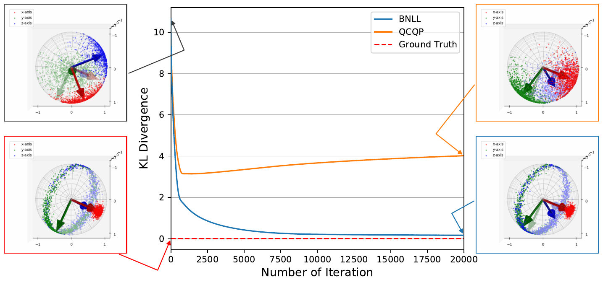

# BinghamNLL

## Overview

The repository contains the implementation of Bingham distribution's Negative Log-Likelihood(NLL) loss function.

Our paper is accepted by *2023 IEEE International Conference on Robotics and Automation (ICRA)* under the title "**A Probabilistic Rotation Representation for Symmetric Shapes With an Efficiently Computable Bingham Loss Function**", by *Hiroya Sato, Takuya Ikeda, and Koichi Nishiwaki*.

The paper and video are available: 
- arXiv: http://arxiv.org/abs/2305.18947
- YouTube: https://www.youtube.com/watch?v=UQEEdeevpDo

If you use our BinghamNLL in your work, please cite as follows:
<pre>
@inproceedings{hiroya_binghamnll_2023,
   author={Hiroya Sato and Takuya Ikeda and Koichi Nishiwaki},
   title={{A Probabilistic Rotation Representation for Symmetric Shapes With an Efficiently Computable Bingham Loss Function}},
   booktitle={{2023 International Conference on Robotics and Automation (ICRA)}},
   year={2023},
   month={May},
   pages={6923-6929},
}
</pre>

## How to install

```bash
git clone https://github.com/woven-planet/BinghamNLL.git
cd BinghamNLL
git submodule update --init --recursive
python3 -m venv venv
source venv/bin/activate
pip install --upgrade pip
pip install -r requirements.txt
pip install -r requirements.cpu.txt
pip install -r requirements.submodule.txt
pip install -e .
```

If you'd like to use GPU, please modify `requirements.gpu.txt` based on your environment.
Then, please use it instead of the above `requirements.cpu.txt`.

To check successful installation,
```bash
python3 -m unittest test/test_bingham_loss.py
```

## Try example codes
Run the following code:
```bash
python3 optim_params.py -N 20 --seed 593
```
- without `--dryrun` option,
  - After running it, you will get `outputs/mats/hhmmss_yyyyMMdd.mat`.
  - The visualization of optimized distribution can be found in `outputs/pngs/*.png`
    - `init.png`: the initial distribution of optimization.
    - `truth.png`: the distribution that sampled points are from.
      - `init.png` and `truth.png` are generated as soon as `optim_params.py` is called.
    - `bnll.png`: the resulting distribution optimized using Bingham NLL loss.
    - `qcqp.png`: the resulting distribution optimized using QCQP Loss ([Peretroukhin et al., 2020](https://github.com/utiasSTARS/bingham-rotation-learning))
  - The optimization result will be saved even if you send `Ctrl-C` during the optimization.
  - The visualized results are saved in `outputs/pdfs/*.pdf`

- with `--show` option the visualized results are shown after optimization.

- You can change the number of sample points by specifying `N` (default = 20).
- You can change the truth distribution by specifying `seed` (default = None).
  - Here we set `seed = 593` for example. This produces the axis symmetric distribution.
  - We found `seed = 593, 784, 847, 914, 949` generates the symmetric distribution.

(Optional)

Visualized results can be created from `outputs/mats/*.mat` after running `optim_params.py`.

Run the following code:
```bash
python3 visualize_mats.py
```
then they are saved in `outputs/pdfs/*.pdf`

You can find the result pdf that looks like the following:



## Unittest

```bash
python3 -m unittest
```


## API Documentation

To get api documenataion, please install sphinx and build it based on the below.

```bash
pip install -r requirements.docs.txt
cd docs
make html
```
Then, `index.html` should be generated in `docs/_build/html` directory.


## About This Project and Us

This work has been done at Woven by Toyota, Inc.
A part of the work is the result of Summer Internship Program.

*Hiroya Sato* is with Department of Mechano-Informatics, Graduate School of Information Science and Technology, The University of Tokyo.

*Takuya Ikeda* and *Koichi Nishiwaki* are with the Woven by Toyota, Inc.

## Acknowledgement

The visualization of Bingham distribution was supported by *Ching-Hsin Fang* and *Duy-Nguyen Ta* in Toyota Research Institute. We'd like to express our deep gratitude to them.


## License
[Apache License 2.0](LICENSE)
